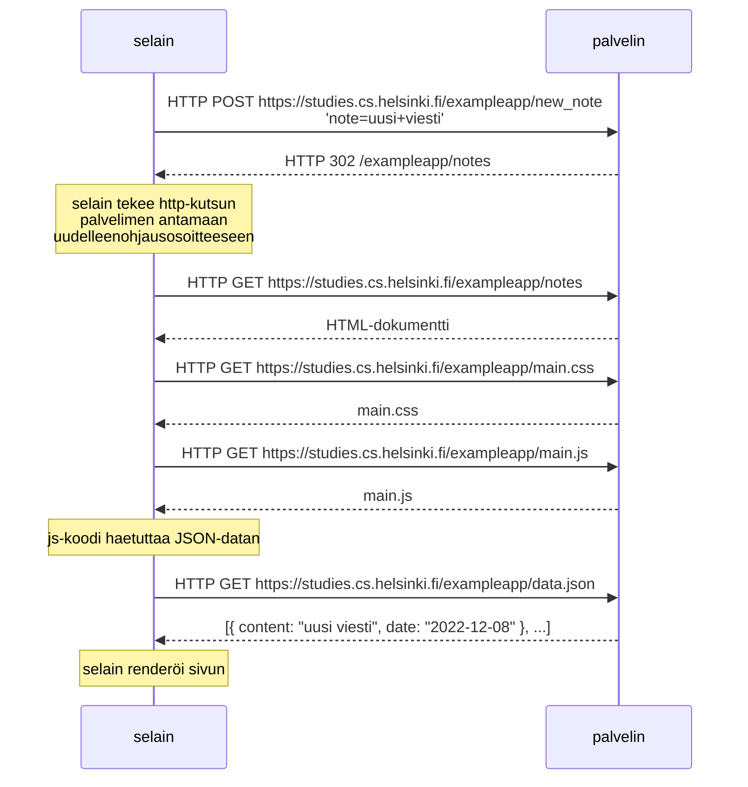
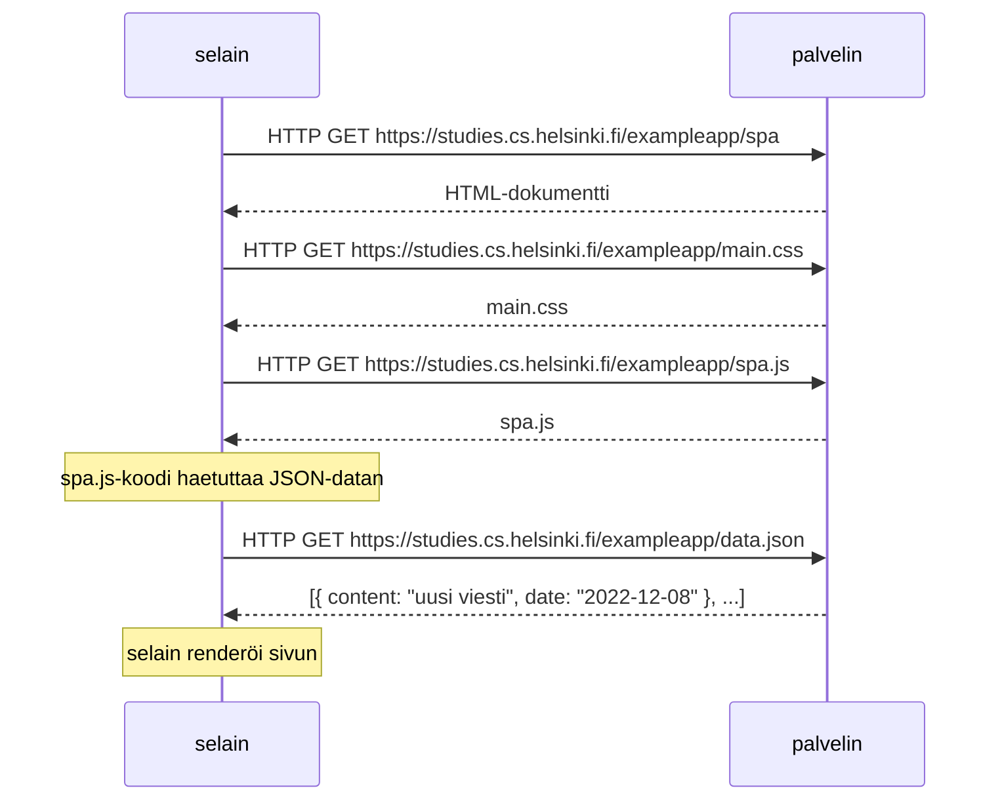
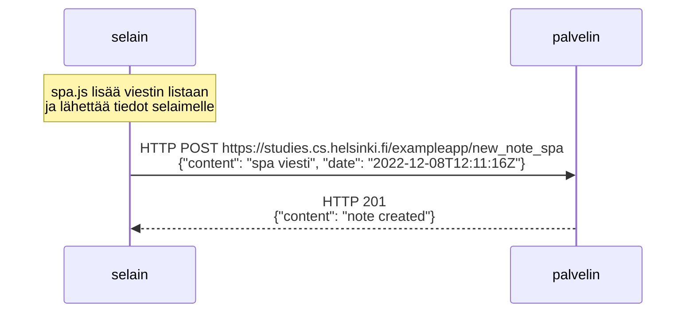

# Osa 0 tehtävät

Tässä on tehtävien 0.4 - 0.6 vastaukset. Kts. https://fullstackopen.com/osa0/web_sovelluksen_toimintaperiaatteita 

Tehtävissä pyydetään piirtämään erilaisia sekvenssikaavioita. Tässä on käytetty [mermaid](https://mermaid-js.github.io/mermaid/) nimistä laajennusta, jonka diagrammeja GitHub osaa automaattisesti renderöidä.

## Tehtävä 0.4

Tee kaavio, joka kuvaa tilannetta, jossa käyttäjä luo uuden muistiinpanon sivulla https://studies.cs.helsinki.fi/exampleapp/notes

### Vastaus

## Tehtävä 0.5

Tee kaavio tilanteesta, jossa käyttäjä menee selaimella osoitteeseen https://studies.cs.helsinki.fi/exampleapp/spa eli muistiinpanojen Single Page App-versioon.

### Vastaus

## Tehtävä 0.6

Tee kaavio tilanteesta, jossa käyttäjä luo uuden muistiinpanon single page -versiossa.

### Vastaus

